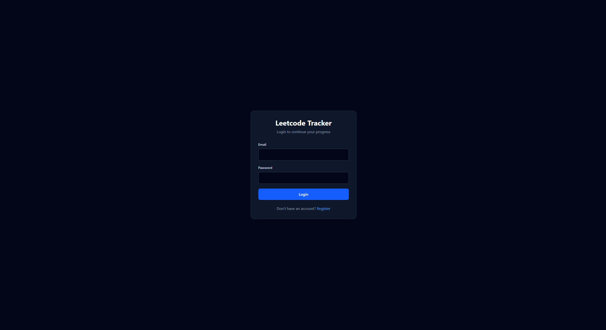
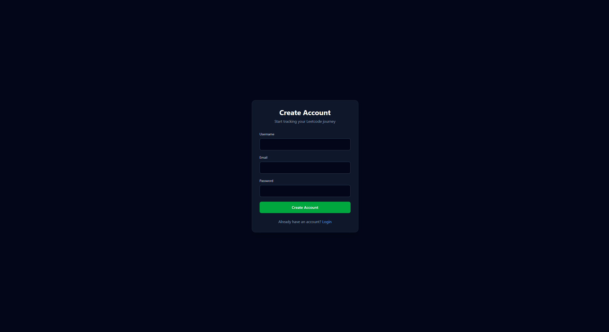
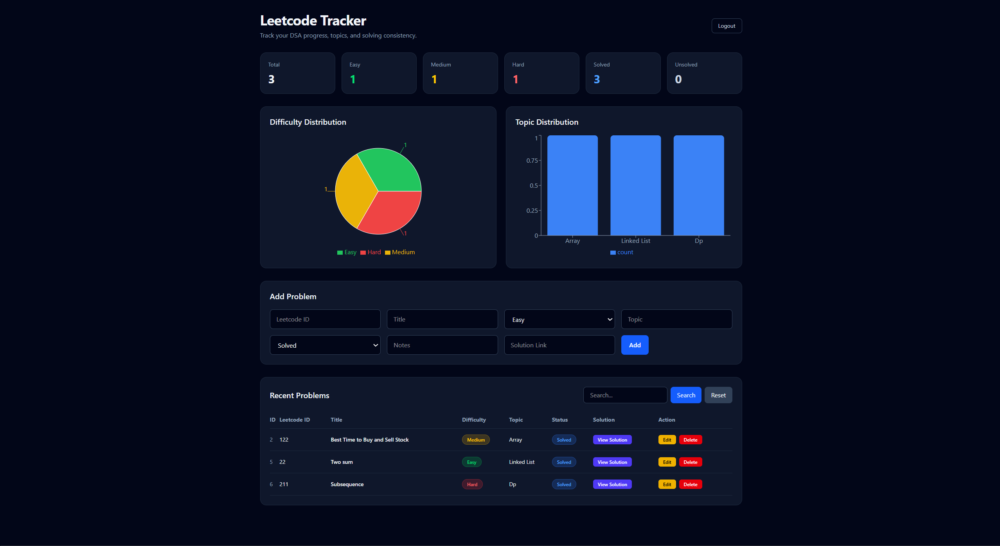

# Leetcode Tracker

A full-stack web application for tracking Leetcode problem-solving progress, analyzing performance, and visualizing coding statistics.

---
## Live Links

- Frontend: https://leetcode-progress-tracker-zeta.vercel.app/
- Backend API: https://leetcode-progress-tracker.onrender.com
- API Docs: https://leetcode-progress-tracker.onrender.com/docs
- GitHub Repository: https://github.com/Lelouch-Lamperouge2004/Leetcode-Progress-Tracker
## Features

### Authentication

* User Registration
* User Login
* JWT Authentication
* Protected Routes

### Problem Management

* Add Problems
* Edit Problems
* Delete Problems
* Search Problems
* Track Difficulty
* Track Topics
* Store Notes
* Store Solution Links

### Dashboard Analytics

* Total Problems Solved
* Easy / Medium / Hard Statistics
* Solved vs Unsolved Count
* Difficulty Distribution Pie Chart
* Topic Distribution Bar Chart

### UI Features

* Dark Theme Dashboard
* Responsive Layout
* Difficulty Badges
* Status Badges
* Search Functionality
* Solution Link Buttons

---

## Tech Stack

### Frontend

* React
* TypeScript
* Vite
* Axios
* React Router
* Tailwind CSS
* Recharts

### Backend

* FastAPI
* SQLAlchemy
* Pydantic
* JWT Authentication
* Alembic

### Database

* PostgreSQL

---

## Project Structure

```text
Leetcode-Tracker
│
├── backend
│   ├── app
│   │   ├── auth
│   │   ├── database
│   │   ├── models
│   │   ├── routers
│   │   ├── schemas
│   │   └── services
│   │
│   ├── alembic
│   └── requirements.txt
│
├── frontend
│   ├── src
│   │   ├── pages
│   │   ├── api
│   │   ├── routes
│   │   └── types
│   │
│   └── package.json
│
└── README.md
```

---

## Screenshots

### Login Page



---

### Register Page



---

### Dashboard



### Login Page

Modern authentication screen with JWT login support.

### Dashboard

* Statistics Cards
* Difficulty Pie Chart
* Topic Distribution Chart
* Problem Management Table

---

## API Endpoints

### Authentication

```http
POST /auth/register
POST /auth/login
```

### Problems

```http
GET    /problems
POST   /problems
PUT    /problems/{id}
DELETE /problems/{id}
```

### Analytics

```http
GET /problems/dashboard
GET /problems/search
```

---

## Installation

### Backend

```bash
cd backend

python -m venv venv

venv\Scripts\activate

pip install -r requirements.txt

uvicorn app.main:app --reload
```

### Frontend

```bash
cd frontend

npm install

npm run dev
```

---

## Future Improvements

* Streak Tracking
* Monthly Progress Chart
* Topic Heatmaps
* GitHub Integration
* Leetcode API Integration
* Export Statistics
* User Profile Page

---

## Description

Developed a full-stack Leetcode Progress Tracker using Python (FastAPI), PostgreSQL, React, TypeScript, and Tailwind CSS. Implemented JWT authentication, CRUD operations, analytics dashboards, search functionality, and interactive data visualizations using Recharts.
